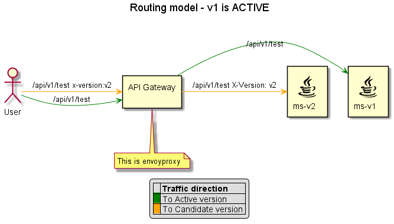
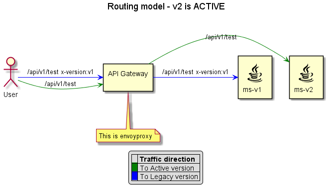
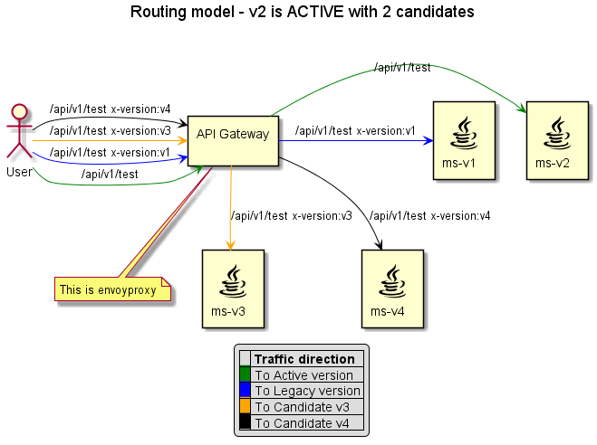
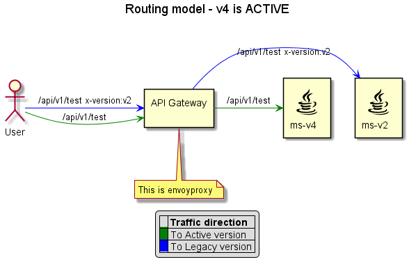
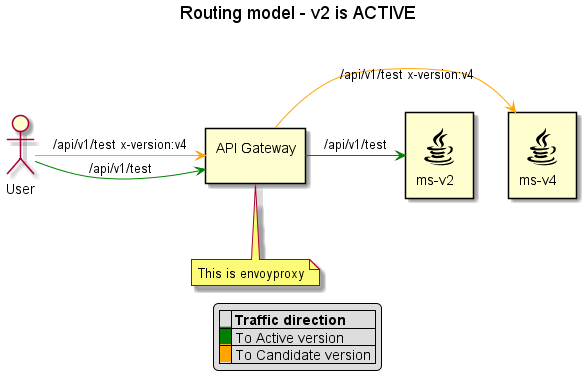

= Blue-green functional
Dmitrii Olkhov
v1.0, 2020-01-17

== Overview
Blue-green is about zero downtime deployment model. It makes sense when you want to upgrade your cloud application without maintenance break.
Simple model of deployment means that you have one environment and when you updates the application you shows stub maintenance page to user.

In our model we assume that application deploys with two or more versions at the same cloud environment. And you can chose which version of application you want to call using HTTP Header _X-Version_. The application which was deployed using another version of bundle is neighbor in environment and called _<<glossary.adoc#_candidate, *Candidate*>>_. The HTTP traffic can be direct to _<<glossary.adoc#_candidate, *Candidate*>>_ and _<<glossary.adoc#_legacy,*Legacy*>>_ only by using requests with _X-Version_ header though at the same time user traffic is direct to *_Active_* version of application.

== Control-plane modes
Control-plane can work in two modes: *VERSIONED* and *NAMESPACED*. So that you want to know which is set now you can call <<api/control-plane-v2.adoc#_getroutingmodedetailsusingget, appropriate endpoint>>. *VERSIONED* mode means control-plane can register routes only with current <<glossary.adoc#_namespace, namespace>> where it was deployed. Whereas *NAMESPACED* mode means control-plane can register routes only with <<glossary.adoc#_version, version>>.

== Promote
This operation is made for changing user traffic direction. When you finish testing *_Candidate_* you can direct all user traffic to it. _<<api/control-plane-v2.adoc#_promoteusingpost, *Promote*>>_ can be called manually using REST API but usually this operation is called by _Deployment Job_. _<<api/control-plane-v2.adoc#_promoteusingpost, *Promote*>>_ switches current Active version to Legacy and _<<glossary.adoc#_candidate, *Candidate*>>_ to Active. Rules of traffic availability for Legacy is the same as for *_Candidate_* (using header).

CAUTION: This operation makes specified version of application (_<<glossary.adoc#_candidate, *Candidate*>>_) as Active. Other Candidates (if only they are present) will be deleted and not available inspite of micro-service instances of these versions are still running in the environment.

.You can't run promote when:
* Your environment has no installed _Candidate_ (because you have nothing to promote)
* You try to promote version of application which is not _Candidate_

=== Changes of control-plane storage
==== State of persistence storage and routing after Blue-green Deployment and calling Promote
Let's consider _<<api/control-plane-v2.adoc#_promoteusingpost, *Promote*>>_ operation in terms of persistence storage and its changes.
Just imagine theoretic situation when you have the only micro-service in cloud environment (which was deployed with Rolling model) and Deployment Job (which was started by you) deployed another version of the same micro-service and to the same environment but this deployment used BlueGreen deployment model.
And each version of the micro-service has only one route which was registered at *Control-plane* under one of gateway _node-group_ (for example public-gateway-service). In this case we have follow data in DB storage. Certainly it's not full representation of real data in DB, it's just slice.

.Routes table state in DB
|===
|ID | prefix | cluster_name | deployment_version

|1
|/api/v1/test
|ms\|\|ms\|\|8080
|v1

|2
|/api/v1/test
|ms\|\|ms\|\|8080
|v2
|===

.Clusters table state in DB
|===
|ID |Name

|1
|ms\|\|ms\|\|8080

|===

.Endpoints table state in DB
|===
|ID | clusterId | address | port | deployment_version

|1
|1
|ms-v1
|8080
|v1

|2
|1
|ms-v2
|8080
|v2

|===

.DeploymentVersions table stat in DB
|===
|version |stage

|v1
|ACTIVE

|v2
|CANDIDATE

|===

How we can see at the tables above DB storage has two records of route, two records of deployment versions and two endpoints under the cluster.
But there is a question how traffic routes in this case. The figure below consider envoy routing.

Now we do next step and call _<<api/control-plane-v2.adoc#_promoteusingpost, *Promote*>>_. In simple cases, when we have the same set of routes into two different versions of the micro-service, changes in DB are quite small.
Our simple case of calling _<<api/control-plane-v2.adoc#_promoteusingpost, *Promote*>>_ operation just change state of _DeploymentVersion_ in DB, nothing else, while routing model changed cardinally.

.DeploymentVersions table stat in DB
|===
|version |stage

|v1
|LEGACY

|v2
|ACTIVE

|===

==== Delete Candidates during Promote
Well, let's do next step and deploy two versions of the same micro-service. They will be 'v3' and 'v4'. The data in DB will be follow:
.Routes table state in DB
|===
|ID | prefix | cluster_name | deployment_version

|1
|/api/v1/test
|ms\|\|ms\|\|8080
|v1

|2
|/api/v1/test
|ms\|\|ms\|\|8080
|v2

|3
|/api/v1/test
|ms\|\|ms\|\|8080
|v3

|4
|/api/v1/test
|ms\|\|ms\|\|8080
|v4

|===

.Clusters table state in DB
|===
|ID |Name

|1
|ms\|\|ms\|\|8080

|===

.Endpoints table state in DB
|===
|ID | clusterId | address | port | deployment_version

|1
|1
|ms-v1
|8080
|v1

|2
|1
|ms-v2
|8080
|v2

|3
|1
|ms-v3
|8080
|v3

|4
|1
|ms-v4
|8080
|v4
|===

.DeploymentVersions table stat in DB
|===
|version |stage

|v1
|LEGACY

|v2
|ACTIVE

|v3
|CANDIDATE

|v4
|CANDIDATE

|===

As we can see at picture above the whole traffic to candidates is possible only with the header while the traffic to <<glossary.adoc#Active, Active>> <<glossary.adoc#Version, version>>

Well we saw v4 of _<<glossary.adoc#_candidate, *Candidate*>>_ are well and stable and decided to <<api/control-plane-v2.adoc#_promoteusingpost, Promote>> it. We call <<api/control-plane-v2.adoc#_promoteusingpost, Promote>> REST API and get follow result:
|===
|ID | prefix | cluster_name | deployment_version

|1
|/api/v1/test
|ms\|\|ms\|\|8080
|v1

|2
|/api/v1/test
|ms\|\|ms\|\|8080
|v2

|4
|/api/v1/test
|ms\|\|ms\|\|8080
|v4

|===

.Clusters table state in DB
|===
|ID |Name

|1
|ms\|\|ms\|\|8080

|===

.Endpoints table state in DB
|===
|ID | clusterId | address | port | deployment_version

|1
|1
|ms-v1
|8080
|v1

|2
|1
|ms-v2
|8080
|v2

|4
|1
|ms-v4
|8080
|v4
|===

.DeploymentVersions table stat in DB
|===
|version |stage

|v1
|ARCHIVE

|v2
|LEGACY

|v4
|ACTIVE

|===
The routing model is to be follow:

There we promoted v4 _<<glossary.adoc#_candidate, *Candidate*>>_ and that means we have v4 as Active version and user traffic is going to ms-v4 without any extra headers. At the same time v3 _<<glossary.adoc#_candidate, *Candidate*>>_ was deleted from DB at all (DeploymentVersion, Endpoints and Routes). Also you can see what v1 became Archive and it's present in DB storage but it's not a participants of routing model.

CAUTION: If you send request to API Gateway with header 'x-version: v1' this request will be routed to ms-v4 because this micro-service belongs to Active version and default strategy of fallback scenario - routing to Active version.

== Rollback
This operation rollbacks to previous version of application. _<<api/control-plane-v2.adoc#_rollbackusingpost, *Rollback*>>_ was made for a situation when you want to cancel <<api/control-plane-v2.adoc#_promoteusingpost, Promote>> operation and to return back previous state of routing.

CAUTION: If you have registered Candidates in control-plane, this operation will delete all of them.

So we call _<<api/control-plane-v2.adoc#_rollbackusingpost, *Rollback*>>_ and according to previous state of db (Table 11) that is what we get:

.DeploymentVersions table stat in DB after rollback
|===
|version |stage

|v1
|ARCHIVE

|v2
|ACTIVE

|v4
|CANDIDATE

|===
Rollback operation made v4 version as _<<glossary.adoc#_candidate, *Candidate*>>_ while v2, which was LEGACY, became Active. But, as you can notice, archive version hasn't changed although you can think that it should become Legacy.

WARNING: Only Recovery operation can cast Archive version to Legacy/Active. This operation is not designed and implemented yet. That means you can't change version which has became Archive.

And the routing model is to be follow:

