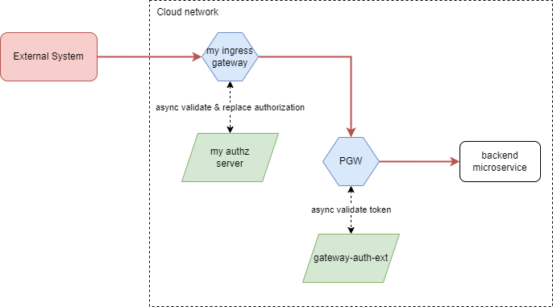

# Custom Ingress Gateways

[[_TOC_]]

## Overview

Out of the box there are two ingress gateways deployed with Cloud-Core application: Public Gateway and Private Gateway. 
All the requests coming from outside the cloud network must go through one of these two gateways for security reasons: these gateways perform token validation via external authorization server (gateway-auth-extension). 
That is why it is forbidden to create ingresses on any other gateway (e.g. internal or composite gateway). 

Consider the following case: you have some external system that calls some microservices' REST API. This external system is not integrated with Cloud-Core identity-provider, so it uses some other authentication mechanism. 
Somehow you need to validate authorization of the request from external system and replace it with token obtained from identity-provider. 

Service Mesh provides possibility to cover such scenario via deploying custom ingress gateway and configuring it to use your custom authorization server. 



## How to use

Below is the step-by-step guide on how to deploy and configure ingress gateway with custom external authorization server.

### Step 0: Prerequisites

* Use Cloud-Core release 2023.2-7.16.0 or newer. 
* Make sure that you meet the requirements of facade-operator: https://github.com/Netcracker/qubership-core-facade-operator#requirement

### Step 1: Deploy your external authorization server

Your custom external authorization server can be included in your application the same way as any other microservice. 

Core gateways use gRPC to communicate with external authorization servers, 
so your authorization server should provide gRPC API described in [envoyproxy docs](https://www.envoyproxy.io/docs/envoy/v1.26.1/intro/arch_overview/security/ext_authz_filter).

### Step 2: Configure ingress gateway deployment

Custom ingress gateway can be deployed via facade-operator microservice that is part of Cloud-Core application.

In order to make facade-operator deploy your gateway, you need to apply FacadeService k8s custom resource with the following content:
```yaml
---
apiVersion: qubership.org/v1alpha
kind: FacadeService
metadata:
  name: my-ingress-gateway
  namespace: {{ .Values.NAMESPACE }}
spec:
  env:
    facadeGatewayCpuLimit: 100m
    facadeGatewayCpuRequest: 100m
    facadeGatewayMemoryLimit: 128Mi
    facadeGatewayMemoryRequest: 128Mi
  gateway: my-ingress-gateway
  port: 8080
  gatewayType: ingress
  allowVirtualHosts: false
  ingresses:
    - hostname: integration-gateway-{{ .Values.NAMESPACE }}.{{ .Values.CLOUD_PUBLIC_HOST }}
      gatewayPort: 8080
    - hostname: integration-gateway-grpc-{{ .Values.NAMESPACE }}.{{ .Values.CLOUD_PUBLIC_HOST }}
      gatewayPort: 8080
      isGrpc: true
```

You can specify any number of `ingresses` in CR, flag `isGrpc` indicates that this ingress will be configured to accept gRPC traffic.
> :warning: Important: Currently, gRPC ingresses deployment on OpenShift platform is not supported by facade-operator.

You can apply this CR manually via kubectl, or you can put it in any of your microservices HELM chart, e.g. in your custom authorization server. 

As a result of applying this CR facade-operator will deploy ingresses with the specified names leading to the service `my-ingress-gateway`,
which will serve traffic to `my-ingress-gateway` deployment.

### Step 3: Configure routes and ExtAuthz filter for your ingress gateway

Now we need to apply routes and ExtAuthz filter configuration to control-plane, 
so your ingress gateway can server traffic and call your external authorization server. 

Please note, that custom ingress gateway MUST route traffic only to Public or Private gateway, so Cloud-Core gateway-auth-extension can also participate in authorization.
Routing to target functional backend microservice should be done by Public or Private gateway after all the gateway-level authorizations were completed.

So, functional backend microservice should register its routes on Public or Private gateway - as usual (see [example](./development-guide.md#register-public-and-private-routes)). 

Prepare `routes-configuration.yaml` file with the following content: it should contain two resources: 
1. `HttpFilters` configuration that will make ingress gateway to perform async calls to external authorization server on any request. 
2. `RouteConfiguration` for your ingress gateway with routes to Public or Private gateway. 

```yaml
---
apiVersion: nc.core.mesh/v3
kind: HttpFilters
spec:
  gateways:
    - my-ingress-gateway
  extAuthzFilter:
    name: myExtAuthzFilter # unique name of extauthz filter for your ingress gateway 
    contextExtensions:
      key1: val1 # some additional parameters that will be passed to your authorization server by gateway with CheckRequest
    destination: # the same `destination` structure as in routes registration API, so you can add TLS settings if necessary
      cluster: ${ENV_SERVICE_NAME}
      endpoint: ${ENV_DEPLOYMENT_RESOURCE_NAME}:10050
---
apiVersion: nc.core.mesh/v3
kind: RouteConfiguration
metadata:
  name: my-ingress-routes
  namespace: "${ENV_NAMESPACE}"
spec:
  gateways: ["my-ingress-gateway"]
  virtualServices:
    - name: my-ingress-gateway
      hosts: ["*"]
      routeConfiguration:
        version: "${ENV_DEPLOYMENT_VERSION}"
        routes:
          - destination:
              cluster: "public-gateway-service"
              endpoint: http://public-gateway-service:8080
            rules:
              - match:
                  prefix: /api/v1/my-integration-api
```

You can place this file as declarative route configuration in your external authorization server repository under the 
`{repository-root}/deployments/routes-configuration.yaml` path. 
In such case configuration will be applied by deployer when deploying your external authorization server.

## Step 4. Deploy your target backend microservice

By now we have configured ingress-gateway and integrated it with custom external authorization server. 
When accessing our new ingress, ingress gateway will perform asyn call to external authorization server and forward request to PGW. 

All we left to do is deploy target backend microservice and register its routes on Public or Private gateway. 

This is done the same way as if we would do without having any custom ingress gateways, just follow the [example](./development-guide.md#register-public-and-private-routes).

## How to delete my custom ExtAuthz HTTP filter?

To delete ExtAuthz filter for gateway, apply the following configuration to Control-Plane: 

```yaml
---
apiVersion: nc.core.mesh/v3
kind: HttpFiltersDrop
spec:
  gateways:
    - my-ingress-gateway
  extAuthzFilter:
    name: myExtAuthzFilter # unique name of extauthz filter for your ingress gateway
```

You can place it in your declarative routes-configuration.yaml in any microservice, 
or you can send this yaml as request body to control-plane [/apply-config REST API](../api/control-plane-api.md#apply-configuration).

## How to delete my ingress gateway?

To delete gateway deployed by facade-operator you just need to delete the facadeService custom resource from k8s, e.g.

`kubectl -n <namespace> delete facadeService my-ingress-gateway`

Please note, that all the ExtAuthz filters and routes configuration for this gateway will remain in control-plane database untouched. 
So, if you will create gateway with such name once again, these configurations will be applied to it. 

If you need to remove the configuration completely, please use control-plane API to do that: 
* [ExtAuthz filter deletion](#how-to-delete-my-custom-extauthz-http-filter)
* [Routes deletion](./routes-deletion-guide.md)
